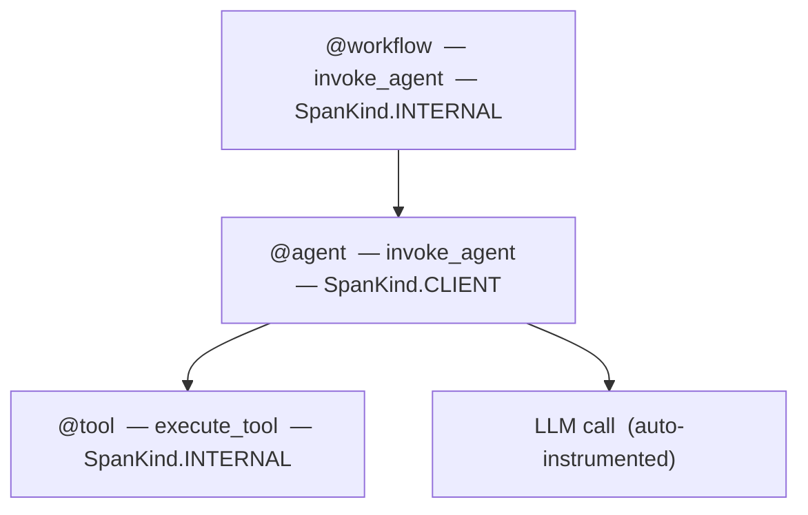

import { Aside } from '@astrojs/starlight/components';

`opensearch-genai-sdk-py` instruments Python LLM applications using standard OpenTelemetry. It configures the OTEL pipeline in one call, provides decorators for tracing your application logic, and emits evaluation scores through the same OTLP exporter.

- **PyPI:** `opensearch-genai-sdk-py`
- **Python:** 3.10, 3.11, 3.12, 3.13
- **Source:** [github.com/vamsimanohar/opensearch-genai-sdk-py](https://github.com/vamsimanohar/opensearch-genai-sdk-py)

## Installation

```bash
pip install opensearch-genai-sdk-py
```

The core package includes the OTEL SDK and OTLP exporters. Auto-instrumentation for LLM providers is opt-in:

```bash
pip install "opensearch-genai-sdk-py[openai]"
pip install "opensearch-genai-sdk-py[anthropic]"
pip install "opensearch-genai-sdk-py[bedrock]"
pip install "opensearch-genai-sdk-py[langchain]"
pip install "opensearch-genai-sdk-py[instrumentors]"   # all providers at once
pip install "opensearch-genai-sdk-py[aws]"             # SigV4 signing for AWS endpoints
pip install "opensearch-genai-sdk-py[all]"             # everything
```

Available provider extras: `openai`, `anthropic`, `cohere`, `mistral`, `groq`, `ollama`, `google`, `bedrock`, `langchain`, `llamaindex`.

## Quick start

```python
from opensearch_genai_sdk_py import register, workflow, agent, tool, score

register(endpoint="http://localhost:4318/v1/traces", service_name="my-app")

@tool(name="get_weather")
def get_weather(city: str) -> dict:
    """Fetch current weather for a city."""
    return {"city": city, "temp": 22, "condition": "sunny"}

@agent(name="weather_assistant")
def assistant(query: str) -> str:
    data = get_weather("Paris")
    return f"{data['condition']}, {data['temp']}C"

@workflow(name="weather_pipeline")
def run(query: str) -> str:
    return assistant(query)

result = run("What's the weather?")
score(name="relevance", value=0.95, trace_id="...", source="llm-judge")
```

---

## `register()`

Configures the OTEL tracing pipeline. Call once at startup before any tracing occurs.

```python
from opensearch_genai_sdk_py import register

register(
    endpoint="http://localhost:4318/v1/traces",
    service_name="my-app",
)
```

| Parameter | Type | Default | Description |
|---|---|---|---|
| `endpoint` | `str` | `http://localhost:21890/opentelemetry/v1/traces` | OTLP endpoint URL. Reads `OPENSEARCH_OTEL_ENDPOINT` if not set. |
| `protocol` | `"http"` \| `"grpc"` | inferred from URL | Force transport. Inferred from scheme if omitted: `grpc://` → gRPC, `grpcs://` → gRPC+TLS, else HTTP. |
| `service_name` | `str` | `"default"` | Attached to all spans as `service.name`. Reads `OTEL_SERVICE_NAME`. |
| `project_name` | `str` | | Alias for `service_name`. |
| `auth` | `str` | `"auto"` | `"auto"` detects AWS endpoints and enables SigV4. `"sigv4"` always signs. `"none"` never signs. |
| `region` | `str` | auto | AWS region for SigV4. Auto-detected from botocore if not provided. |
| `service` | `str` | `"osis"` | AWS service name for signing. `"osis"` for OpenSearch Ingestion, `"es"` for OpenSearch Service. |
| `batch` | `bool` | `True` | `True` uses `BatchSpanProcessor` (production). `False` uses `SimpleSpanProcessor` (debugging). |
| `auto_instrument` | `bool` | `True` | Discovers and activates installed OTel instrumentor packages. |
| `exporter` | `SpanExporter` | | Custom exporter. Overrides `endpoint`, `auth`, and `protocol`. |
| `set_global` | `bool` | `True` | Register as the global `TracerProvider`. |
| `headers` | `dict` | | Additional HTTP headers for the exporter. |

`register()` returns the configured `TracerProvider`.

### Endpoint schemes

| URL scheme | Transport |
|---|---|
| `http://` or `https://` | OTLP HTTP (default) |
| `grpc://` | OTLP gRPC, insecure |
| `grpcs://` | OTLP gRPC with TLS |

### Examples

Self-hosted OpenSearch with a local collector:

```python
register(service_name="my-app")
# uses http://localhost:21890/opentelemetry/v1/traces by default
```

AWS OpenSearch Ingestion with SigV4:

```python
register(
    endpoint="https://pipeline.us-east-1.osis.amazonaws.com/v1/traces",
    service_name="my-app",
    auth="sigv4",
    region="us-east-1",
)
```

gRPC:

```python
register(endpoint="grpc://localhost:4317", service_name="my-app")
```

Custom exporter:

```python
from opentelemetry.exporter.otlp.proto.http.trace_exporter import OTLPSpanExporter

register(
    service_name="my-app",
    exporter=OTLPSpanExporter(endpoint="http://localhost:4318/v1/traces"),
)
```

---

## Decorators

Four decorators trace application logic as OTEL spans with [GenAI semantic convention](https://opentelemetry.io/docs/specs/semconv/gen-ai/) attributes. All four support sync functions, async functions, generators, and async generators. Errors are recorded as span status `ERROR` with an exception event.

### Span hierarchy

A typical trace looks like this:



`@agent` defaults to `SpanKind.CLIENT` because it typically represents a call out to an external LLM or service.

### Common parameters

All four decorators accept the same parameters:

| Parameter | Type | Description |
|---|---|---|
| `name` | `str` | Span name and entity name. Defaults to the function's `__qualname__`. |
| `version` | `int` | Stored as `gen_ai.agent.version`. |
| `kind` | `SpanKind` | Override the OTel `SpanKind`. |
| `name_from` | `str` | Name of a function parameter whose runtime value becomes the entity name. Useful for dispatcher patterns. |

### `@workflow`

Top-level orchestration. Creates a span with `gen_ai.operation.name = "invoke_agent"` and `SpanKind.INTERNAL`.

```python
from opensearch_genai_sdk_py import workflow

@workflow(name="qa_pipeline")
def run_pipeline(query: str) -> str:
    plan = plan_steps(query)
    return execute(plan)
```

Span attributes set automatically: `gen_ai.operation.name`, `gen_ai.agent.name`, `gen_ai.input.messages`, `gen_ai.output.messages`.

### `@task`

A discrete unit of work within a workflow. Same attributes and defaults as `@workflow`.

```python
from opensearch_genai_sdk_py import task

@task(name="summarize")
def summarize_text(text: str) -> str:
    return llm.generate(f"Summarize: {text}")
```

### `@agent`

Autonomous decision-making logic. Defaults to `SpanKind.CLIENT`. Span name is prefixed: `invoke_agent <name>`.

```python
from opensearch_genai_sdk_py import agent

@agent(name="research_agent", version=2)
async def research(query: str) -> str:
    while not done:
        action = decide_action(query)
        result = await execute_action(action)
    return result
```

### `@tool`

A function invoked by an agent. Span name is prefixed: `execute_tool <name>`.

```python
from opensearch_genai_sdk_py import tool

@tool(name="web_search")
def search(query: str) -> list[dict]:
    """Search the web for documents."""
    return search_api.query(query)
```

Additional attributes set on tool spans: `gen_ai.tool.name`, `gen_ai.tool.type` (`"function"`), `gen_ai.tool.description` (first line of docstring), `gen_ai.tool.call.arguments`, `gen_ai.tool.call.result`.

**Dispatcher pattern** — when the tool name is only known at call time, use `name_from` to resolve it from a runtime argument:

```python
@tool(name_from="tool_name")
def execute_tool(self, tool_name: str, arguments: dict) -> dict:
    """Routes calls to the appropriate tool implementation."""
    return self._tools[tool_name](**arguments)
```

Each call produces a span named `execute_tool <actual_tool_name>`.

### Custom output attributes

If you set `gen_ai.output.messages` (or `gen_ai.tool.call.result` for tools) inside the function body, the decorator will not overwrite it:

```python
from opentelemetry import trace
import json

@agent(name="my_agent")
def my_agent(query: str) -> str:
    result = do_work(query)
    span = trace.get_current_span()
    span.set_attribute(
        "gen_ai.output.messages",
        json.dumps([{"role": "assistant", "content": result}])
    )
    return result
```

---

## `score()`

Submits an evaluation score as an OTEL span. Scores flow through the same OTLP pipeline as traces and land in the same OpenSearch index.

```python
from opensearch_genai_sdk_py import score
```

### Span-level scoring

Score a specific span — a single LLM call or tool execution:

```python
score(
    name="accuracy",
    value=0.95,
    trace_id="abc123",
    span_id="def456",
    explanation="Answer matches ground truth",
    source="heuristic",
)
```

### Trace-level scoring

Score an entire workflow run:

```python
score(
    name="relevance",
    value=0.92,
    trace_id="abc123",
    explanation="Response addresses the user's query",
    source="llm-judge",
)
```

### Session-level scoring

Score across multiple traces in a conversation:

```python
score(
    name="user_satisfaction",
    value=0.88,
    conversation_id="session-123",
    label="satisfied",
    source="human",
)
```

### Parameters

| Parameter | Type | Description |
|---|---|---|
| `name` | `str` | Metric name, e.g. `"relevance"`, `"factuality"`. |
| `value` | `float` | Numeric score. |
| `trace_id` | `str` | Trace being scored. Stored as `gen_ai.evaluation.trace_id`, not the span's own trace ID. |
| `span_id` | `str` | Span being scored (span-level). |
| `conversation_id` | `str` | Session ID (session-level). |
| `label` | `str` | Human-readable label, e.g. `"pass"`, `"relevant"`. |
| `explanation` | `str` | Evaluator rationale. Truncated to 500 characters. |
| `response_id` | `str` | LLM completion ID for correlation. |
| `source` | `str` | Who created the score: `"sdk"`, `"human"`, `"llm-judge"`, `"heuristic"`. |
| `metadata` | `dict` | Arbitrary key-value metadata, stored as `gen_ai.evaluation.metadata.<key>`. |

Scores are emitted as `gen_ai.evaluation.result` spans with `gen_ai.evaluation.*` attributes.

### Getting the trace ID

Read the trace ID from the active span context:

```python
from opentelemetry import trace

@workflow(name="my_pipeline")
def run(query: str) -> str:
    ctx = trace.get_current_span().get_span_context()
    trace_id = format(ctx.trace_id, "032x")
    result = do_work(query)
    return result

# After run() returns, score using the captured trace_id
```

---

## AWS authentication

For AWS-hosted endpoints (OpenSearch Ingestion or OpenSearch Service), requests must be signed with AWS SigV4.

`register()` handles this automatically when `auth="sigv4"` or when `auth="auto"` detects an `*.amazonaws.com` endpoint. Requires the `[aws]` extra:

```bash
pip install "opensearch-genai-sdk-py[aws]"
```

```python
register(
    endpoint="https://pipeline.us-east-1.osis.amazonaws.com/v1/traces",
    service_name="my-app",
    auth="sigv4",
    region="us-east-1",      # auto-detected from botocore if not set
    service="osis",           # "osis" for OSIS pipelines, "es" for OpenSearch Service
)
```

Credentials are resolved via the standard botocore chain: `AWS_ACCESS_KEY_ID` / `AWS_SECRET_ACCESS_KEY` env vars → `~/.aws/credentials` → IAM role / IMDS.

<Aside type="caution">
SigV4 + gRPC is not supported. Use `https://` (OTLP HTTP) for AWS endpoints.
</Aside>

### `AWSSigV4OTLPExporter`

The exporter used internally by `register()` when SigV4 is enabled. Use it directly when you need more control:

```python
from opensearch_genai_sdk_py import AWSSigV4OTLPExporter, register

exporter = AWSSigV4OTLPExporter(
    endpoint="https://pipeline.us-east-1.osis.amazonaws.com/v1/traces",
    service="osis",
    region="us-east-1",
)
register(service_name="my-app", exporter=exporter)
```

---

## Auto-instrumentation

`register()` discovers and activates installed instrumentor packages via OTEL entry points. Install the extra for your LLM provider and its calls are traced automatically — no code changes needed.

| Provider / framework | Extra |
|---|---|
| OpenAI, OpenAI Agents | `[openai]` |
| Anthropic | `[anthropic]` |
| Amazon Bedrock | `[bedrock]` |
| LangChain | `[langchain]` |
| LlamaIndex | `[llamaindex]` |
| Cohere | `[cohere]` |
| Mistral | `[mistral]` |
| Groq | `[groq]` |
| Ollama | `[ollama]` |
| Google Generative AI + Vertex AI | `[google]` |
| All of the above + more | `[instrumentors]` |

The `[instrumentors]` bundle also includes Together, Replicate, Writer, Voyage AI, SageMaker, watsonx, Haystack, CrewAI, Agno, MCP, Transformers, ChromaDB, Pinecone, Qdrant, Weaviate, Milvus, LanceDB, Marqo.

To disable auto-instrumentation:

```python
register(auto_instrument=False)
```

---

## Environment variables

| Variable | Description | Default |
|---|---|---|
| `OPENSEARCH_OTEL_ENDPOINT` | OTLP endpoint URL | `http://localhost:21890/opentelemetry/v1/traces` |
| `OTEL_SERVICE_NAME` | Service name for all spans | `"default"` |
| `OPENSEARCH_PROJECT` | Project name (fallback to `OTEL_SERVICE_NAME`) | `"default"` |
| `AWS_DEFAULT_REGION` | AWS region for SigV4 | auto-detected by botocore |
| `AWS_ACCESS_KEY_ID` | AWS access key | botocore credential chain |
| `AWS_SECRET_ACCESS_KEY` | AWS secret key | botocore credential chain |

---

## Related links

- [JavaScript SDK](/opensearch-agentops-website/docs/sdks/javascript/) — TypeScript/Node.js equivalent
- [Agent Traces](/opensearch-agentops-website/docs/apm/agent-traces/) — viewing traces in OpenSearch Dashboards
- [Send Data](/opensearch-agentops-website/docs/send-data/) — OTLP pipeline and collector setup
- [FAQ](/opensearch-agentops-website/docs/sdks/faq/) — common questions
- [GenAI semantic conventions](https://opentelemetry.io/docs/specs/semconv/gen-ai/) — OTel spec reference
- [PyPI](https://pypi.org/project/opensearch-genai-sdk-py/) — package page
